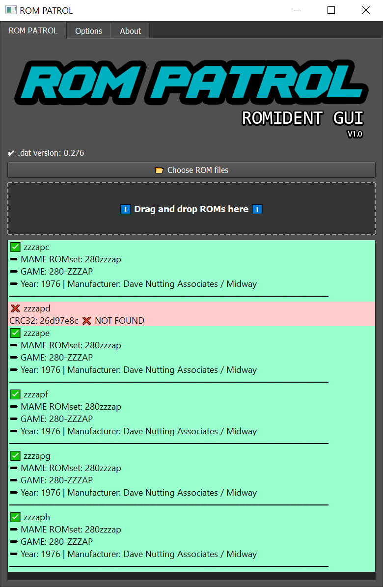

# 🎮 ROM PATROL V1.1.0

**ROM PATROL** is a Windows application for verifying arcade ROM files by comparing them against [MAME](https://www.mamedev.org/) `.dat` databases.  

---

## 🚀 Features

- 🖱️ Drag and drop ROM files or folders
- 🧩 Supports CRC32 and SHA1 hash verification
- 🌓 Light, Dark, and Terminal interface modes
- 🔡 English and Spanish language support

---

## 🧠 How it works

1. Drag one or more ROM files (ZIP or BIN) into the main window.
2. Each ROM is verified by its CRC32 or SHA1 checksum.
3. Matching results will show the ROM name, description, year, and manufacturer.

---

## 🖥️ Requirements

- **OS:** Windows 10 or later  

---

## 🖥️ Download

Download the latest Windows installer from the [Releases](https://github.com/gleegum/ROM-PATROL/releases) page.

---

## 📄 License

This project is free for personal and educational use. It does not include any ROM files. Users are solely responsible for the ROM content they scan.

---

